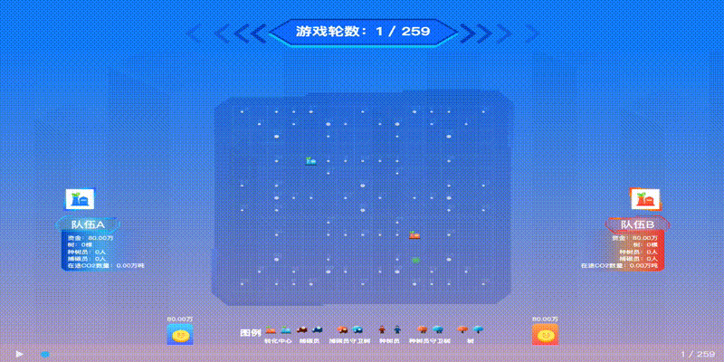

# 捕碳大作战 (Carbon Challenge)

# 游戏背景
在“碳达峰”、“碳中和”提出的大背景下，应加快节能降耗脚步，进而实现二氧化碳减排目标。有两位玩家为了帮助A省减排，决定成立各自的捕碳小组。<br/>
初始时，二氧化碳对称地分布在地图上，选手对称分布在地图左上方和右下方。<br/>
随后，选手可控制捕碳员去收集二氧化碳，然后将收集到的二氧化碳运送回转化中心并产生收益；可控制种树员去种树，然后将树吸收的二氧化碳实时转化为收益。<br/>
当游戏进行了300回合或者场上只剩下一个选手时，游戏结束，此时具有最多收益的选手获胜。<br/>



# 游戏地图
* 地图大小为 15 x 15，地图的坐标原点为左下角，横轴为x轴，纵轴为y轴，且地图无边界。
* 游戏开始时，二氧化碳随机对称地分布在地图四周，且地图的每个单元格二氧化碳上限为50万吨。
* 游戏开始时，每位选手拥有1个二氧化碳转化中心和50万现金。转化中心对称分布在地图左上方和右下方，且分布位置固定。
* 游戏过程中，地图上每个单元格最多能容纳100万吨二氧化碳。如果当前单元格上没有捕碳员或种树员停留，也没有树或转化中心，则当前单元格的二氧化碳会以5%的速度再生，直至最大容量100万吨。

# 游戏角色
## 转化中心
**智能体角色**，用来把捕碳员运输回来的二氧化碳，通过高压处理用于油气资源采集，每转化1万吨二氧化碳可获得1万收益。<br/>转化中心可招募种树员和捕碳员共计10位，为其工作获得更多的收益。

|  动作        | 指令          | 花费（单位：万）  |
|  ----       | ----         | ----  |
| 招募捕碳员    | RECCOLLECTOR | 30    |
| 招募种树员    | RECPLANTOR   | 30    |

## 种树员
**智能体角色**，被招募后以其所在组的转化中心为起始出发点，可进行上、下、左、右移动，可种树和抢树。

|  动作        | 指令          | 花费（单位：万）  |
|  ----       | ----         | ----  |
| 向上移动      | UP           | 0    |
| 向下移动      | DOWN         | 0    |
| 向左移动      | LEFT         | 0    |
| 向右移动      | RIGHT        | 0    |
| 种树         | 无           | 20    |
| 抢树         | 无           | 20    |

## 捕碳员
**智能体角色**，被招募后以其所在组的转化中心为起始出发点，可进行上、下、左、右移动，可以捕碳和抢树。

|  动作        | 指令          | 花费（单位：万）  |
|  ----       | ----         | ----  |
| 向上移动      | UP           | 0    |
| 向下移动      | DOWN         | 0    |
| 向左移动      | LEFT         | 0    |
| 向右移动      | RIGHT        | 0    |
| 捕碳         | 无            | 0    |
| 抢树         | 无           | 20    |

## 树
**非智能体角色**，寿命为50回合，被种下后可吸收其周围8个单元格的二氧化碳增长量并实时转化为收益。

# 游戏规则
* 在游戏的每一回合，选手可以给转化中心下达招募捕碳员或种树员的指令，可以给捕碳员和种树员下达往左、往右、往上、往下的指令。
* 转化中心招募捕碳员或种树员上限为10位，招募种类由选手自行决定。
* 捕碳员和种树员的移动无边界，可穿透地图直接到达地图的另一边。
* 如果捕碳员没有接收到指令，那么他将停留在原地不动。如果当前停留位置含有二氧化碳，那么他将收集当前位置二氧化碳含量的50%，并将收集到的二氧化碳存储在自身上。每位捕碳员没有二氧化碳存储上限。
* 捕碳员身上的二氧化碳需要运送回转化中心转换成收益，当捕碳员到达转化中心时，二氧化碳会立马转换成收益，此时转换不需要花费现金。
* 如果种树员没有接收到指令，那么他将停留在原地不动。如果当前停留位置没有树和转化中心，并且选手的现金足够种树，那么他将在当前位置种一棵树。种下树后，当前位置的二氧化碳归零。每个种树员没有种树的数量上限。
* 树吸收二氧化碳无边界，可穿透地图吸收地图另一边的二氧化碳。
* 树吸收的二氧化碳转化收益，转化率为 1万吨二氧化碳:1万现金，树周围8个单元格的二氧化碳不再增长。
* 若树周围8个单元格中有单元格正在被捕碳员捕集二氧化碳，则不吸收此单元格的二氧化碳增长量。
* 树消失后，单元格产生5万吨的二氧化碳，且单元格的二氧化碳从下一轮开始恢复正常增长。
* 当捕碳员或种树员停留在其他选手的树下时，若捕碳员或种树员的归属玩家的现金足以支付抢树金额，则发生抢树行为。
* 当捕碳员或种树员停留在其他选手的转化中心时，无影响。
* 当捕碳员或种树员前往同一单元格，将会产生碰撞，碰撞者身上的二氧化碳掉落，且碰撞者毁灭。若当前单元格有树，二氧化碳被树吸收实时转化为收益；若当前单元格有转化中心，二氧化碳被转化中心实时转化为收益；否则，二氧化碳掉落在当前单元格。
* 在每一回合，选手能够获取整个地图的所有信息，包括二氧化碳的分布位置，所有捕碳员、种树员、树和转化中心的位置。

# 动作优先级
在游戏的每一回合，首先判断选手给出的指令是否有效，然后按照以下顺序解析同时发生的动作：
1. 转化中心招募种树员/捕碳员，种树员/捕碳员移动，树吸收二氧化碳
2. 碰撞检测
3. 捕碳员回转化中心转化收益
4. 种树员种树，捕碳员捕碳，种树员/捕碳员抢树
5. 单元格co2正常增长

# 结束条件
* 当选手失去所有捕碳员、种树员、树，或者当前转化中心不足以招募捕碳员或种树员时，则会被淘汰。
* 选手给出动作指令的时间为1s，多余1s的时间会统计为超时时间，当超时时间总和大于60s时候，会直接被淘汰。
* 如果选手在中途就被淘汰，那么他的现金数会被赋予一个负数，淘汰时间越早则负数越小，只有完整地和环境交互300回合，才能使用转换成功的现金作为此局的结果。
* 游戏结束时，具有最多现金的选手获胜。

# 快速上手

## 获取信息
```python
from zerosum_env import make
from zerosum_env.envs.carbon.helpers import *

# 构建环境
env = make("carbon")

# 构建指定参数的环境
# env = make("carbon", configuration={"episodeSteps":300, "size": 21, "randomSeed": 123456,})

# 查看环境的各项参数
config = env.configuration

# 确定地图选手数(只能是1,2,4)
num_agent = 2

# 获取自身初始观测状态并查看
obs = env.reset(num_agent)[0].observation

# 将obs转换为Board类从而更好获取信息
board = Board(obs, config)

# 查看当前地图
print("查看当前地图：首位表示格子中的CO2，R0表示玩家0的基地，C0表示玩家0的捕碳员，P0表示玩家0的种树员，T0表示玩家0的树 ")
print(board)

# 获取自身对象
me = board.current_player

# 获取自身初始的金额总数
print("获取自身初始的金额总数")
print(me.cash)

# 招募捕碳员
print("招募捕碳员")
for recrtCenter in me.recrtCenters:
    recrtCenter.next_action = RecrtCenterAction.RECCOLLECTOR
board = board.next()
me = board.current_player


# 查看当前地图
print("查看招募捕碳员后的地图：首位表示格子中的CO2，R0表示玩家0的基地，C0表示玩家0的捕碳员，P0表示玩家0的种树员，T0表示玩家0的树")
print(board)

# 获取自身当前的金额总数
print("获取自身当前的金额总数")
print(me.cash)

# 获取自身当前的工人id列表
print("获取自身当前的工人id列表")
print(me.worker_ids)

# 获取自身当前的转化中心id列表
print("获取自身当前的转化中心id列表")
print(me.recrtCenter_ids)

# 获取自身当前的树id列表
print("获取自身当前的树id列表")
print(me.tree_ids)

# 获取自身捕碳员信息
print("获取自身捕碳员信息")
for worker in me.collectors:
  print(worker.id, worker.occupation, worker.carbon, worker.position)

# 获取自身种树员信息
print("获取自身种树员信息")
for worker in me.plantors:
  print(worker.id, worker.occupation, worker.carbon, worker.position)
  
# 获取自身转化中心信息
print("获取自身转化中心信息")
for recrtCenter in me.recrtCenters:
  print(recrtCenter.id, recrtCenter.position)
  
# 获取自身树信息
print("获取自身树信息")
for tree in me.trees:
  print(tree.id, tree.position, tree.age)
  
# 获取所有种树员信息
print("获取所有种树员信息")
for plantor in board.plantors.values():
  print(plantor.id, plantor.occupation, plantor.carbon, plantor.position)

# 获取所有捕碳员信息
print("获取所有捕碳员信息")
for collector in board.collectors.values():
  print(collector.id, collector.occupation, collector.carbon, collector.position)

# 获取所有转化中心信息
print("获取所有转化中心信息")
for recrtCenter in board.recrtCenters.values():
  print(recrtCenter.id, recrtCenter.position, recrtCenter.player_id)
  
# 获取所有树信息
print("获取所有树信息")
for tree in board.trees.values():
  print(tree.id, tree.position, tree.player_id)

# 获取所有co2信息
print("获取所有co2信息")
sum = 0
for cell in board.cells.values():
  print(cell.position, cell.carbon, cell.plantor, cell.worker, cell.collector)
  sum += cell.carbon
  
# 获取当前地图的co2总数
print("获取当前地图的co2总数")
print(sum)

# 需要注意的是，以上通过position属性获取的位置，
# 均以地图左下角为原点, 与np.array的索引不同。
```

## 与环境交互
```python
from zerosum_env import make
from zerosum_env.envs.carbon.helpers import *

# 构建一个环境
env = make("carbon")

def my_agent(observation, configuration):

  board = Board(observation, configuration)
  me = board.current_player

  # 给自身所有捕碳员下达往上移动的指令
  for worker in me.collectors:
    worker.next_action = WorkerAction.UP
  
  # 给自身所有种树员下达往下移动的指令
  for worker in me.plantors:
    worker.next_action = WorkerAction.DOWN
  
  # 给自身所有捕碳员下达往左移动的指令
  for worker in me.collectors:
    worker.next_action = WorkerAction.LEFT
  
  # 给自身所有种树员下达往右移动的指令
  for worker in me.plantors:
    worker.next_action = WorkerAction.RIGHT

  # 给自身所有转化中心下达招募捕碳员的指令
  for recrtCenter in me.recrtCenters:
    recrtCenter.next_action = RecrtCenterAction.RECCOLLECTOR

  # 给自身所有转化中心下达招募种树员的指令
  for recrtCenter in me.recrtCenters:
    recrtCenter.next_action = RecrtCenterAction.RECPLANTOR
      
  # 给环境返回指令
  return me.next_actions

# 选取random agent作为对手
# run 函数将会运行300轮
env.run([my_agent, "random"])

# 渲染对战画面(打开jupyter notebook运行此命令才能看到渲染画面)
env.render(mode="ipython")

# 注意的是在提交代码的时候，选手也要将自己的智能体用上述 my_agent 函数的形式封装起来，
# 函数以 observation 和 configuration 作为输入，输出对自身每个工人和转化中心的指令，
# 具体请参考 baseline 中的 submission.py 文件
```

## 训练接口

```python
from zerosum_env import make

env = make("carbon", debug=True)

# 假设现在要训练第一个智能体，那么使用 env.train接口，并且将第一个字段设置为 None，环境则会返回此位置选手的观测信息。
# 将第二个选手设为内置的 random agent，如果你想使用其他智能体，可以设为一个智能体函数(智能体函数参考上节中的my_agent函数)

# 注意的是，只有一个位置可以被设置为None

trainer = env.train([None, "random"])
obs = trainer.reset()
for _ in range(100):
    env.render()
    action = [{ 'player-0-recrtCenter-0': 'RECCOLLECTOR'}, None] # 给出 None 位置智能体的动作
    obs, reward, done, info = trainer.step(action)
    if done:
        obs = trainer.reset()
```

```python
from zerosum_env import make

env = make("carbon", debug=True)

# 我们提供了一个接口 train_selfplay 可以在多个位置设置为None
# 假设现在需要同时训练两个智能体互相对战,另外两个智能体为内置的random agent
# 那么可以调用此接口并传入 [None, None, 'random', 'random']告诉环境需要返回前两个位置的智能体观测
trainer = env.train_selfplay([None, None, 'random', 'random'])
obs = trainer.reset()

for _ in range(100):

    # 给环境返回一个动作列表，将不需要训练的智能体的动作设为None,如第三，四个智能体为random agent，因此将三四位置的动作设置为None
    # 第一二个智能体需要训练，在列表的第一二个位置放置这些智能体的动作指令
    action = [{}, {}, None, None]

    # step 函数将返回 训练智能体的观测信息 和 环境结束标志
    # 由于某个智能体结束游戏并不意味着整盘游戏结束，因此 terminal 表示环境是否结束，智能体的结束标志通过done获取
    player_infos, terminal = trainer.step(action)
    observation_next = [infos[0] for infos in player_infos]
    rews = [infos[1] for infos in player_infos]
    dones = [infos[2] for infos in player_infos]
    info = [infos[3] for infos in player_infos]
    if terminal:
        obs = trainer.reset()

```

## 异常

总共有3种异常
1. **Timeout** : 推理时间超出限制
2. **Error** - 代码运行中报错
3. **Invalid** - 非法指令

在构建环境的时候，应当将debug字段设置为True

```python
from zerosum_env import make
def agent():
  # 将id为'0-1'的飞船指令设为非法字符串
  return {"0-1": "bad"}
env = make("carbon", debug=True)
env.run([agent, "random"])
# print Invalid Action: 'bad' is not one of ['RECCOLLECTOR', 'RECPLANTOR', 'UP', 'DOWN', 'RIGHT', 'LEFT']

def agent():
  import time
  time.sleep(2)
  return {}
env = make("carbon", debug=True)
env.run([agent, "random"])
# print Timeout: 输出Timeout信息，因为超过了推理时间限制

def agent():
  return "Illegal action"
env = make("carbon", debug=True)
env.run([agent, "random"])
# 不会输出任何错误信息，没有对飞船下达指令，因此飞船和基地的动作为None,不会触发异常


```

## 评估

```python
from zerosum_env import evaluate

def agent():
  return {}
# Which agents to run repeatedly.  Same as env.run(agents)
agents = ["random", agent]

# How many times to run them.
num_episodes = 2

rewards, jsons, htmls, errors = evaluate("carbon", agents, num_episodes=num_episodes)
# 查看rewards可以看到每一局评估，每个选手最后的金额数量
```


